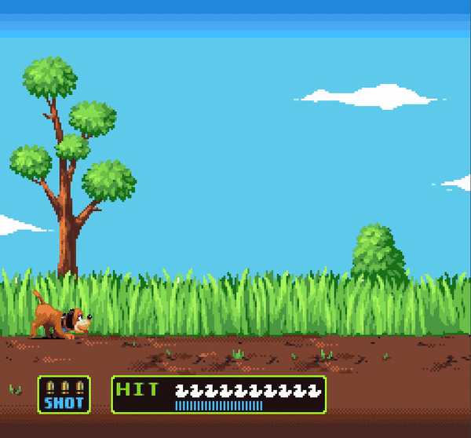

# My hunter

The goal is to shoot the ducks with your mouse, try to shoot them with only 3 bullets !
######This was my first graphical project

## Requirement

Language : C

Library CSFML is needed [Installation](https://www.sfml-dev.org/download/csfml/index-fr.php)

######Binary file can be also found if you don't want to install the CSFML and just try my "my_hunter".

## Usage

```
> ./my_hunter
```

## Compiling

######Go in the project directory

Clean (*.o files)
```
> make clean
```

Full clean (*.o and binary file)
```
> make fclean
```

Compile
```
> make
```

Full clean and compile
```
> make re
```

Compile with gdb (debugging)
```
> make gdb
```

## Preview

A cool gif to show you a little preview !



## Year

This project was done in 2017

## License
Project from [EPITECH](https://www.epitech.eu/) school made by Luis ROSARIO
