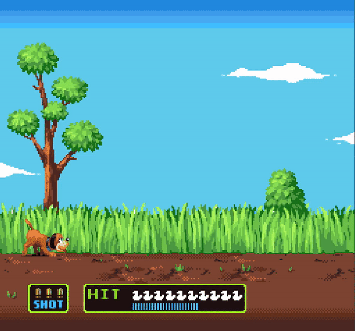
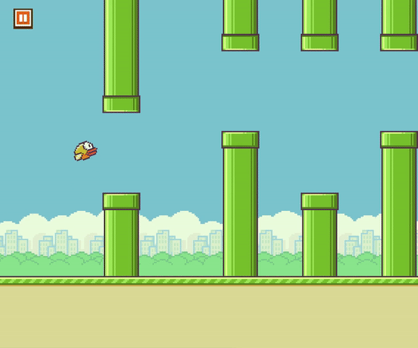
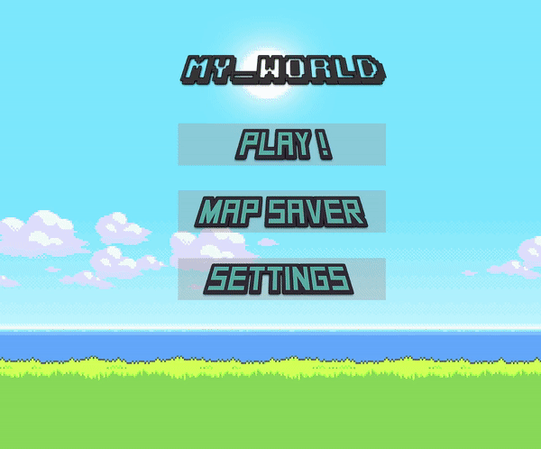

# Graphical projects

| Name | Language | Grade | Year |
| :--- | :---: | :---: | ---:|
| My hunter | C / CSFML | B | 2017 |
| My runner | C / CSFML | B | 2017 |
| My world | C / CSFML | B | 2018 |
| My rpg | C / CSFML | A | 2018 |

## Requirement

Language : C

Library CSFML is needed [Installation](https://www.sfml-dev.org/download/csfml/index.php)

These 4 projects are made with the CSFML library, witch is pretty hard to install.

## Installation CSFML (only for Linux)

Installation of SFML (needed by CSFML) and CSFML :

```bash
sudo dnf install SFML
sudo dnf install SFML-devel
sudo dnf install CSFML
sudo dnf install CSFML-devel

or 

sudo apt-get install libsfml-dev
sudo apt-get install libcsfml-dev
```

## Compiling

###### Go in one project directory

Clean (*.o files)

```bash
make clean
```

Full clean (*.o and binary file)

```bash
make fclean
```

Compile

```bash
make
```

Full clean and compile

```bash
make re
```

Compile with gdb (debugging)

```bash
make gdb
```

## Previews

#### My Hunter



#### My Runner



#### My World



#### My Rpg


## Year

These projects were done in 2017 and 2018

## Authors

* **Luis Rosario** - *Member 1* - [Luisrosario2604](https://github.com/Luisrosario2604)
